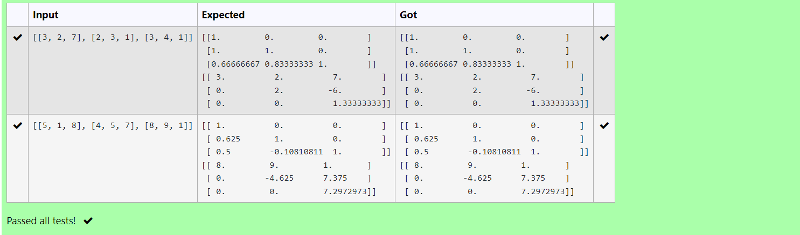

# LU Decomposition 

## AIM:
To write a program to find the LU Decomposition of a matrix.

## Equipments Required:
1. Hardware – PCs
2. Anaconda – Python 3.7 Installation / Moodle-Code Runner

## Algorithm
1. START THE PROGRAM
2. IMPORT numpy,scipy
3. USE lu_solve,lu_factor
4. END THE PROGRAM

## Program:
```

'''Program to find L and U matrix using LU decomposition.
Developed by: NITEESH M
RegisterNumber: 22008756
'''
import numpy as np
from scipy.linalg import lu
A = np.array(eval(input()))
P,L,U=lu(A)
print(L)
print(U)

```

## Output:



## Result:
Thus the program to find the LU Decomposition of a matrix is written and verified using python programming.

